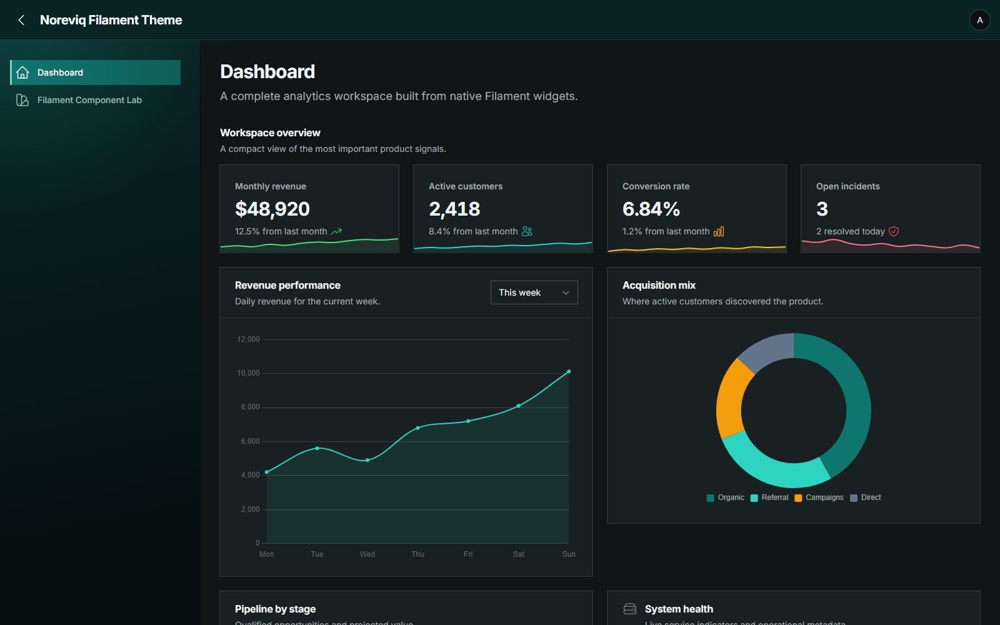
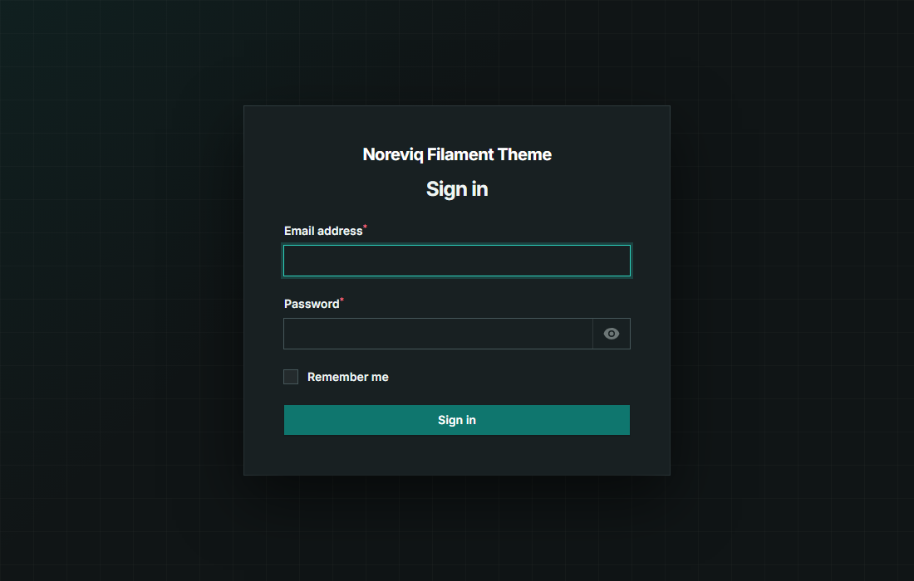
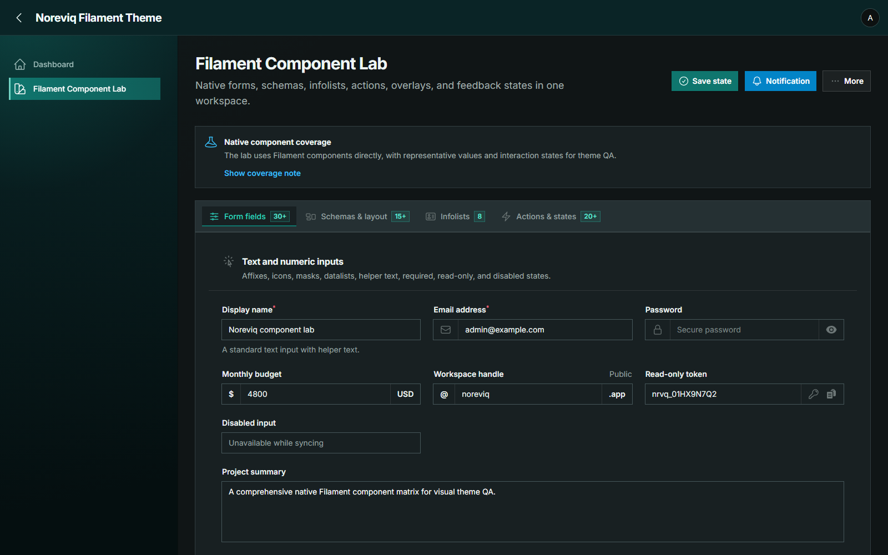
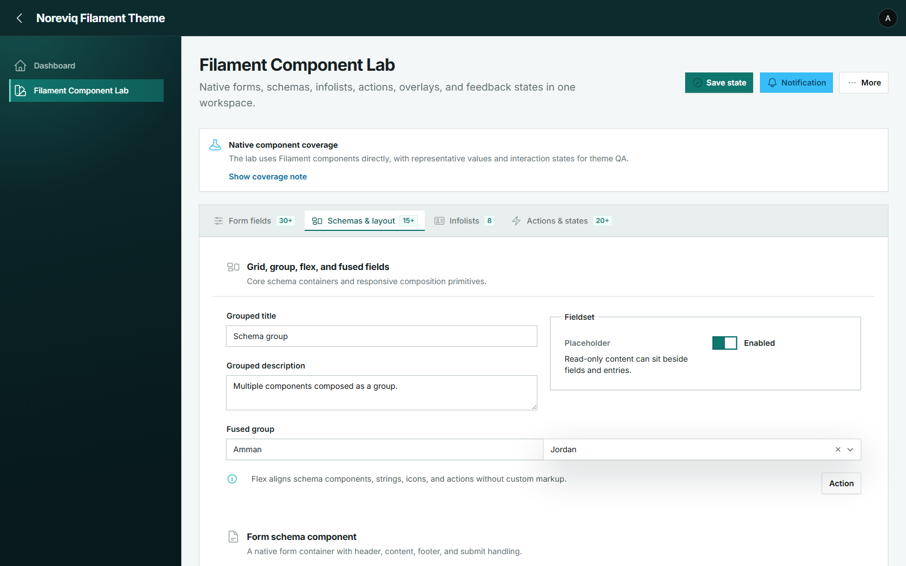

# Noreviq Filament Theme

<p align="center">
    
</p>

<p align="center"><sub>Noreviq dashboard · Dark mode</sub></p>

Noreviq is a teal and graphite theme plugin for Filament panels. It ships as
ready-to-use CSS with no frontend build step in the consuming application.

## Preview

<table>
    <tr>
        <td width="50%"></td>
        <td width="50%"></td>
    </tr>
    <tr>
        <td align="center"><sub>Authentication</sub></td>
        <td align="center"><sub>Native Filament components</sub></td>
    </tr>
</table>

<details>
    <summary><strong>Light mode preview</strong></summary>
    <br>
    
</details>

## Compatibility

| Filament | PHP |
| --- | --- |
| 4.x | 8.2+ |
| 5.x | 8.2+ |

## Installation

```bash
composer require noreviq/filament-theme
```

Register the plugin on each panel that should use Noreviq:

```php
use Filament\Panel;
use Noreviq\FilamentTheme\NoreviqThemePlugin;

public function panel(Panel $panel): Panel
{
    return $panel
        // Keep your normal panel configuration here.
        ->plugin(NoreviqThemePlugin::make());
}
```

Publish the theme assets after registering the plugin:

```bash
php artisan filament:assets
```

## Options

Noreviq exposes three typed visual options:

```php
use Noreviq\FilamentTheme\Enums\AuthStyle;
use Noreviq\FilamentTheme\Enums\CornerStyle;
use Noreviq\FilamentTheme\Enums\ShadowStyle;

NoreviqThemePlugin::make()
    ->corners(CornerStyle::Sharp)
    ->shadows(ShadowStyle::Balanced)
    ->authStyle(AuthStyle::Noreviq);
```

| Option | Values | Default |
| --- | --- | --- |
| Corners | `Sharp`, `Subtle`, `Native` | `Sharp` |
| Shadows | `Flat`, `Balanced`, `Elevated` | `Balanced` |
| Auth | `Noreviq`, `Native` | `Noreviq` |

Run `php artisan filament:assets` again after changing a preset or upgrading the
package.

The palette is part of the theme and is intentionally fixed. Noreviq does not
change panel navigation, dimensions, content width, branding, font, routes,
authentication, authorization, responsiveness, or component behavior.

## Development

```bash
composer install
node bin/build.mjs
node bin/verify.mjs
composer test
```

## License

MIT. Created by Yousef Al-Jallad
([eng.yousef.aljallad@gmail.com](mailto:eng.yousef.aljallad@gmail.com)).
